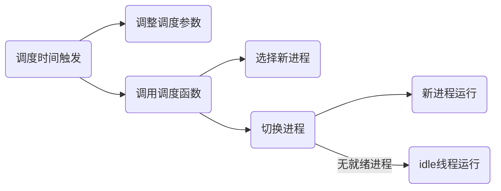

# Lab6 调度器

## OS原理

- 调度管理机制
- 系统调度器框架，Round-Robin 调度算法
- Stride Scheduling调度算法

到目前为止，采用的调度策略是很简单的FIFO调度策略。本次实验，主要是熟悉ucore的系统调度器框架，以及基于此框架的Round-Robin（RR） 调度算法。然后参考RR调度算法的实现，完成Stride Scheduling调度算法。

## ucore调度框架

接用C语言的函数指针，实现“类”的功能

初始化：


调度过程：



## 练习1: 使用 Round Robin 调度算法

分析sched_class中各个函数指针的用法，并结合 Round Robin 调度算法描 ucore 的调度执行过程

sched_class（kern\schedule\sched.h）

```c
// The introduction of scheduling classes is borrrowed from Linux, and makes the 
// core scheduler quite extensible. These classes (the scheduler modules) encapsulate 
// the scheduling policies. 
struct sched_class {
    // the name of sched_class
    const char *name;
    // Init the run queue
    void (*init)(struct run_queue *rq);
    // put the proc into runqueue, and this function must be called with rq_lock
    void (*enqueue)(struct run_queue *rq, struct proc_struct *proc);
    // get the proc out runqueue, and this function must be called with rq_lock
    void (*dequeue)(struct run_queue *rq, struct proc_struct *proc);
    // choose the next runnable task
    struct proc_struct *(*pick_next)(struct run_queue *rq);
    // dealer of the time-tick
    void (*proc_tick)(struct run_queue *rq, struct proc_struct *proc);
    /* for SMP support in the future
     *  load_balance
     *     void (*load_balance)(struct rq* rq);
     *  get some proc from this rq, used in load_balance,
     *  return value is the num of gotten proc
     *  int (*get_proc)(struct rq* rq, struct proc* procs_moved[]);
     */
};
```

* init：初始化队列
* enqueue：进程入队
* dequeue：进程出队
* pick_next：选择下一调度进程
* pro_tick：时间片

就绪队列结构体，管理所有处于就绪态的进程

```c
struct run_queue {
    list_entry_t run_list;
    unsigned int proc_num;  // 当前进程个数
    int max_time_slice;
};
```

schedule是调度的总控函数，负责调用调度算法的各个函数。它会在do_exit、do_wait、init_main、cpu_idle、trap和lock等调度点被调用。

```c
void
schedule(void) {
    bool intr_flag;
    struct proc_struct *next;
    local_intr_save(intr_flag);
    {
        current->need_resched = 0;
        if (current->state == PROC_RUNNABLE) {  // 如果当前的进程处于就绪态
            sched_class_enqueue(current);  // 入队
        }
        if ((next = sched_class_pick_next()) != NULL) {  // 选择下一个要执行的进程（还没执行出队操作）
            sched_class_dequeue(next);  // 从就绪队列中出队
        }
        if (next == NULL) {
            next = idleproc;  // 如果没找到，会运行这个特殊的内核线程，会循环调用schedule
        }
        next->runs ++;
        if (next != current) {
            proc_run(next);  // 如果选中了新进程，进行进程切换
        }
    }
    local_intr_restore(intr_flag);
}
```

RR入队函数

```c
static void
RR_enqueue(struct run_queue *rq, struct proc_struct *proc) {
    assert(list_empty(&(proc->run_link)));
    list_add_before(&(rq->run_list), &(proc->run_link));  // 加入队列，插入双向链表的尾部
    if (proc->time_slice == 0 || proc->time_slice > rq->max_time_slice) {
        proc->time_slice = rq->max_time_slice;  // 设置时间片
    }
    proc->rq = rq;
    rq->proc_num ++;
}
```

RR出队函数

```c
static void
RR_dequeue(struct run_queue *rq, struct proc_struct *proc) {
    assert(!list_empty(&(proc->run_link)) && proc->rq == rq);
    list_del_init(&(proc->run_link));  // 从双向链表删除
    rq->proc_num --;
}
```

RR选择函数

```c
static struct proc_struct *
RR_pick_next(struct run_queue *rq) {
    list_entry_t *le = list_next(&(rq->run_list));  // 选择双向链表头部元素
    if (le != &(rq->run_list)) {
        return le2proc(le, run_link);
    }
    return NULL;
}
```

RR算法的proc_tick函数，产生时钟中断时被调用

```c
static void
RR_proc_tick(struct run_queue *rq, struct proc_struct *proc) {
    if (proc->time_slice > 0) {
        proc->time_slice --;  // 时间片自减
    }
    if (proc->time_slice == 0) {
        proc->need_resched = 1;  // 时间片用光，需要被换出去
    }
}
```

RR调度算法的就绪队列在组织结构上也是一个双向链表，只是增加了一个成员变量，表明在此就绪进程队列中的最大执行时间片。而且在进程控制块proc_struct中增加了一个成员变量time_slice，用来记录进程当前的可运行时间片段。这是由于RR调度算法需要考虑执行进程的运行时间不能太长。在每个timer到时的时候，操作系统会递减当前执行进程的time_slice，当time_slice为0时，就意味着这个进程运行了一段时间（这个时间片段称为进程的时间片），需要把CPU让给其他进程执行，于是操作系统就需要让此进程重新回到rq的队列尾，且重置此进程的时间片为就绪队列的成员变量最大时间片max_time_slice值，然后再从rq的队列头取出一个新的进程执行。

如何设计实现“多级反馈队列调度算法”？

- 首先调度优先级高的队列中的进程。若高优先级中队列中已没有调度的进程，则调度次优先级队列中的进程
- 对于同一个队列中的各个进程，按照时间片轮转法调度。比如Q1队列的时间片为N，那么Q1中的作业在经历了N个时间片后若还没有完成，则进入Q2队列等待，若Q2的时间片用完后作业还不能完成，一直进入下一级队列，直至完成。
- 在低优先级的队列中的进程在运行时，又有新到达的作业，那么在运行完这个时间片后，CPU马上分配给新到达的作业。

## 练习2: 实现 Stride Scheduling 调度算法

换掉RR调度器的实现，即用default_sched_stride_c覆盖default_sched.c。然后根据此文件和后续文档对Stride度器的相关描述，完成Stride调度算法的实现。

相比于 RR 调度算法，Stride Scheduling 算法定义了一个比较器：

```c
/* The compare function for two skew_heap_node_t's and the
 * corresponding procs*/
static int
proc_stride_comp_f(void *a, void *b)
{
     struct proc_struct *p = le2proc(a, lab6_run_pool);
     struct proc_struct *q = le2proc(b, lab6_run_pool);
     int32_t c = p->lab6_stride - q->lab6_stride;  // 步数相减，通过结果的正负比较大小关系
     if (c > 0) return 1;
     else if (c == 0) return 0;
     else return -1;
}
```

初始化队列

```c
static void
stride_init(struct run_queue *rq) {
     list_init(&(rq->run_list));
     rq->lab6_run_pool = NULL;
     rq->proc_num = 0;
}
```

入队

```c
static void
stride_enqueue(struct run_queue *rq, struct proc_struct *proc) {
     /* LAB6: YOUR CODE */
#if USE_SKEW_HEAP
     rq->lab6_run_pool =
          skew_heap_insert(rq->lab6_run_pool, &(proc->lab6_run_pool), proc_stride_comp_f);
#else
     assert(list_empty(&(proc->run_link)));
     list_add_before(&(rq->run_list), &(proc->run_link));
#endif
     if (proc->time_slice == 0 || proc->time_slice > rq->max_time_slice) {
          proc->time_slice = rq->max_time_slice;
     }
     proc->rq = rq;
     rq->proc_num ++;
}
```

在ucore中，USE_SKEW_HEAP为1，所以else不会执行

对于skew_heap_insert函数

```c
static inline skew_heap_entry_t *
skew_heap_insert(skew_heap_entry_t *a, skew_heap_entry_t *b,
                 compare_f comp) {
     skew_heap_init(b);  // 初始化进程b
     return skew_heap_merge(a, b, comp);  // 返回a与b进程结合的结果
}

static inline void
skew_heap_init(skew_heap_entry_t *a) {
     a->left = a->right = a->parent = NULL;
}

static inline skew_heap_entry_t *
skew_heap_merge(skew_heap_entry_t *a, skew_heap_entry_t *b,
                compare_f comp) {
     if (a == NULL) return b;
     else if (b == NULL) return a;
     
     skew_heap_entry_t *l, *r;
     if (comp(a, b) == -1) {  // a进程的步长小于b进程
          r = a->left;
          l = skew_heap_merge(a->right, b, comp);
          
          a->left = l;
          a->right = r;
          if (l) l->parent = a;

          return a;
     } else {
          r = b->left;
          l = skew_heap_merge(a, b->right, comp);
          
          b->left = l;
          b->right = r;
          if (l) l->parent = b;

          return b;
     }
}
```

初始化刚进入运行队列的进程 proc 的`stride`属性，然后比较队头元素与当前进程的步数大小，选择步数最小的运行，即将其插入放入运行队列中去，这里并未放置在队列头部。最后初始化时间片，然后将运行队列进程数目加一。

出队

```c
static void
stride_dequeue(struct run_queue *rq, struct proc_struct *proc) {
     /* LAB6: YOUR CODE */
#if USE_SKEW_HEAP
     rq->lab6_run_pool =
          skew_heap_remove(rq->lab6_run_pool, &(proc->lab6_run_pool), proc_stride_comp_f);
#else
     assert(!list_empty(&(proc->run_link)) && proc->rq == rq);
     list_del_init(&(proc->run_link));
#endif
     rq->proc_num --;
}
```

完成将一个进程从队列中移除的功能，这里使用了优先队列。最后运行队列数目减一。

选择下一个进程

```c
static struct proc_struct *
stride_pick_next(struct run_queue *rq) {
     /* LAB6: YOUR CODE */
#if USE_SKEW_HEAP
     if (rq->lab6_run_pool == NULL) return NULL;
     struct proc_struct *p = le2proc(rq->lab6_run_pool, lab6_run_pool);
#else
     list_entry_t *le = list_next(&(rq->run_list));

     if (le == &rq->run_list)
          return NULL;
     
     struct proc_struct *p = le2proc(le, run_link);
     le = list_next(le);
     while (le != &rq->run_list)
     {
          struct proc_struct *q = le2proc(le, run_link);
          if ((int32_t)(p->lab6_stride - q->lab6_stride) > 0)
               p = q;
          le = list_next(le);
     }
#endif
     if (p->lab6_priority == 0)
          p->lab6_stride += BIG_STRIDE;  // 步长设置为最大值
     else p->lab6_stride += BIG_STRIDE / p->lab6_priority;
     return p;
}
```

先扫描整个运行队列，返回其中stride值最小的对应进程，然后更新对应进程的stride值，将步长设置为优先级的倒数，如果为0则设置为最大的步长。

时间片

```c
static void
stride_proc_tick(struct run_queue *rq, struct proc_struct *proc) {
     if (proc->time_slice > 0) {
          proc->time_slice --;
     }
     if (proc->time_slice == 0) {
          proc->need_resched = 1;
     }
}
```

检测当前进程是否已用完分配的时间片。如果时间片用完,应该正确设置进程结构的相关标记来引起进程切换。

总结：

首先是初始化函数`stride_init`。 开始初始化运行队列，并初始化当前的运行队，然后设置当前运行队列内进程数目为0。然后是入队函数`stride_enqueue`，根据之前对该调度算法的分析，这里函数主要是初始化刚进入运行队列的进程 proc 的`stride`属性，然后比较队头元素与当前进程的步数大小，选择步数最小的运行，即将其插入放入运行队列中去，这里并未放置在队列头部。最后初始化时间片，然后将运行队列进程数目加一。然后是出队函数`stride_dequeue`，即完成将一个进程从队列中移除的功能，这里使用了优先队列。最后运行队列数目减一。接下来就是进程的调度函数`stride_pick_next`，观察代码，它的核心是先扫描整个运行队列，返回其中stride值最小的对应进程，然后更新对应进程的stride值，将步长设置为优先级的倒数，如果为0则设置为最大的步长。最后是时间片函数`stride_proc_tick`，主要工作是检测当前进程是否已用完分配的时间片。如果时间片用完,应该正确设置进程结构的相关标记来引起进程切换。

